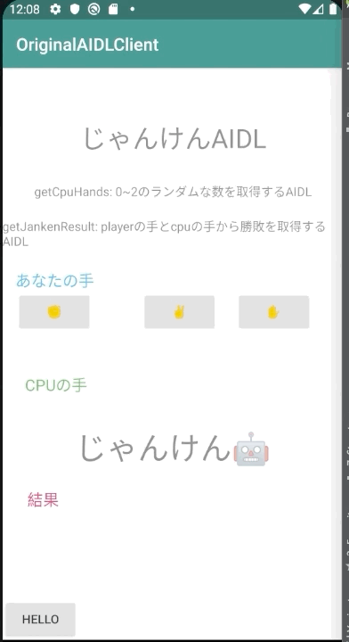

# Janken AIDL

情報アーキテクチャ特論の課題で作成したオリジナルAIDL

## 実装したAIDL

### int getCpuHand()
0〜2の中からランダムな数を返す

### String getJankenReskt(int player_hand, int cpu_hand)
プレイヤーの手とCPUの手を受け取りじゃんけんの勝敗を返す

## デモ

## ハマったところ
- AIDLのinterfaceをMainActivityでimportできなかった
  - AIDLファイルにエラーがあり、Javaのコードが正しく生成されていなかったのが原因っぽい

## 参考
- [Home  >  Android
Android Interface Definition Language (AIDL) Example](https://www.concretepage.com/android/android-interface-definition-language-aidl-example)
